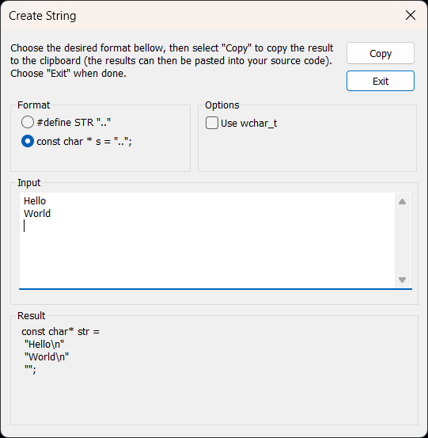

# Createstring

## Installing

Open  `Menu Tools > External Tools ...`
Copy the path used by `Create &GUID`
Close the dialog.

Copy the executable CreateString.exe to this path.

For instance:
"C:\Program Files\Microsoft Visual Studio\2022\Professional\Common7\Tools\"

Then add the new tool

Open  `Menu Tools > External Tools ...` again

